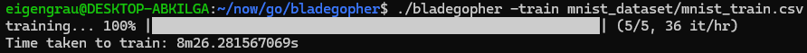
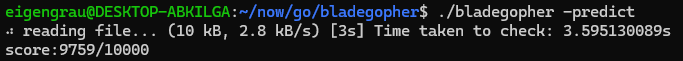
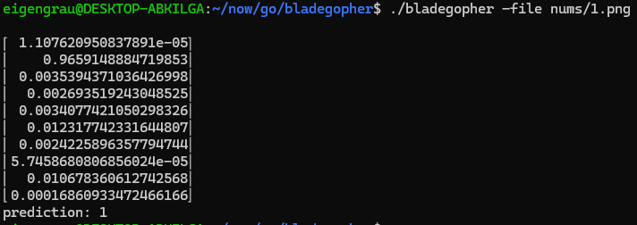
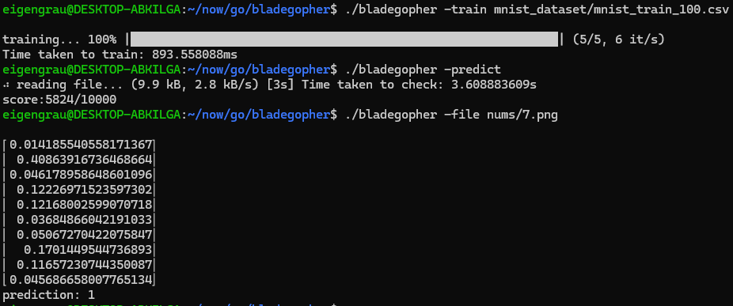

# Blade Gopher

A CLI app to understand Artificial Neural Networks writen in Golang.


## Install

Clone this repo into your working directory.
```sh
git clone git@github.com:eigengrau01/bladegopher.git
```

Then move to the project directory and build the app.
```sh
cd bladegopher/
go mod tidy
go build -o bladegopher
```

Move to mnist_dataset/ directory and Unzip the file.
```sh
cd mnist_dataset/
unzip mnist.zip -d .
```

If you don't have Unzip install it:
```sh
sudo apt-get install unzip
```

Go back to the root directory and the app is ready to use.
```sh
cd ..
```
## Usage

### Train:

In mnist_dataset/ you have different datasets, the mnist_train.csv is the larger file and therefore gives the best results:




But it's the one you have to wait the longest, like 7 to 8 minutes.
Once you train with a dataset, you don't have to train the Network again, unless you want to explore how the Network behaves with other datasets.

### Predict:

Before using an image to predict and test the network, you can see how well it performs in 10,000 cases.



### File:

To predict which number is in the image using the network, you must pass it a 28x28 pixel PNG image.



Now you can Explore with other datasets, read the code or the repo on References and try to undestand by yourself the basics of Artificial Neural Network:



## References
To undestand this code better and how Multilayer Perceptron works read this [Awesome Repo](https://github.com/sausheong/gonn).
